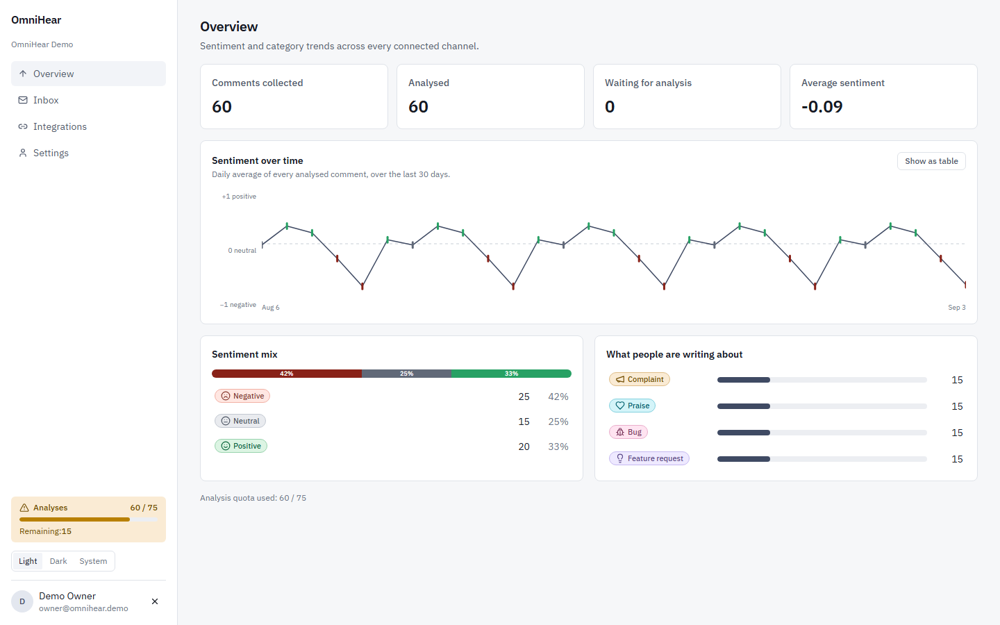
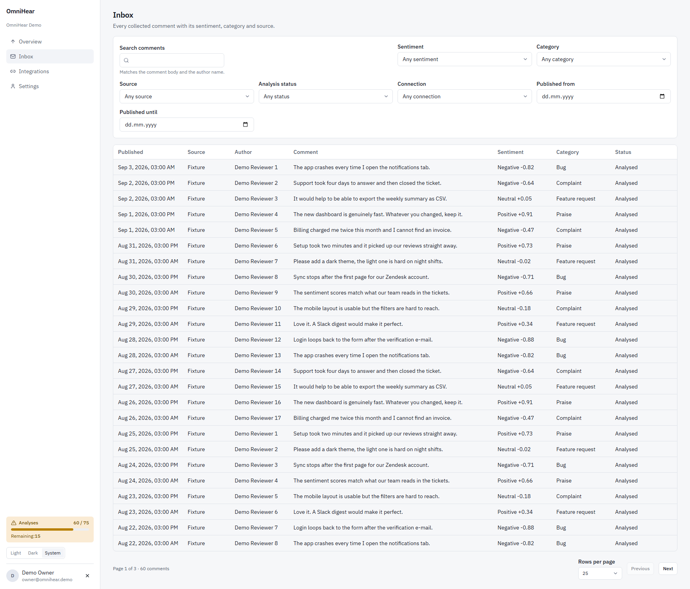
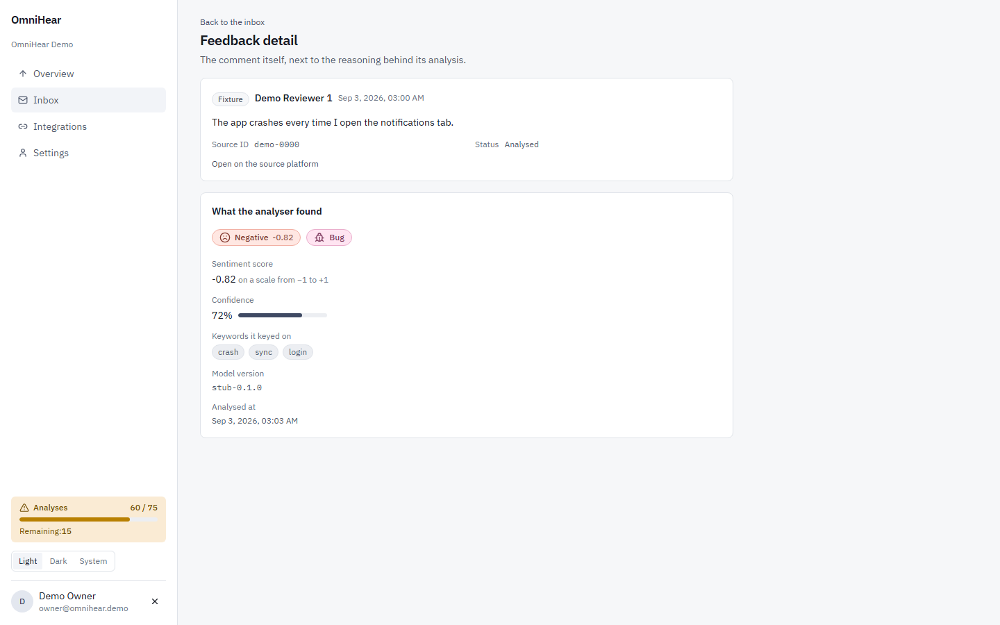
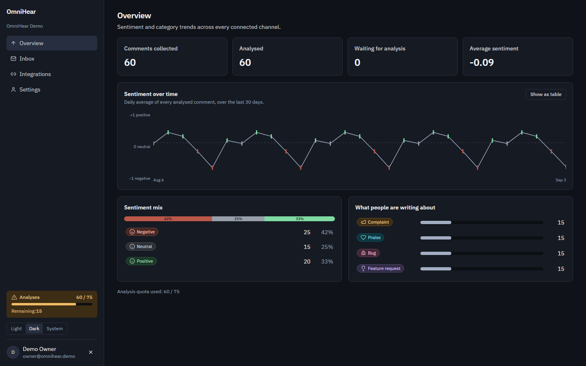
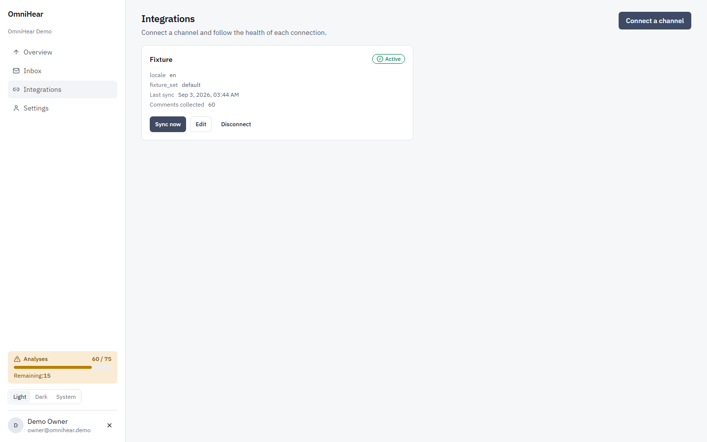
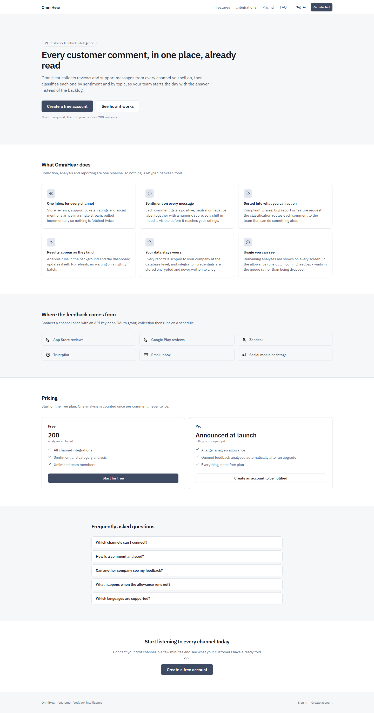

# OmniHear

[English](README.md) · **Türkçe**

Spec §2'nin saydığı altı kanaldan — App Store, Google Play, Zendesk, Trustpilot,
e-posta (JMAP) ve sosyal medya (Mastodon hashtag zaman çizelgeleri) — müşteri
geri bildirimi toplayan, bunları duygu analizi ve kategori sınıflandırması için
bir yapay zekâ hattından geçiren, ve şirketlere kota denetimli analiz ile
paywall'lu gerçek zamanlı bir gelen kutusu sunan bir **B2B SaaS** platformu.
Bu fazın dışında bilinçli olarak bırakılan her şey (Sentry/Prometheus, IP/cihaz
risk skorlaması ve diğerleri) `docs/adr/0010-deliberate-scope-exclusions.md`
içinde, her biri gerekçesiyle kayıtlı.

## Mimari, tek paragrafta

Üç servis. `backend/` (Laravel 13, PHP 8.3, PostgreSQL 16) tüm ürün verisinin ve
çok kiracılılığın sahibi — her tablo bir `company_id` ile kapsanır, kiracılar
arası erişim **404** döner, 403 değil. Geri bildirim toplama ve AI analizi
Horizon/Redis kuyruk işleri olarak koşar, asla bir HTTP isteğinin içinde değil.
`ai-service/` (Python 3.12, FastAPI, ONNX) **durumsuz** bir analizördür: HMAC
imzalı bir iç çağrıyla metin alır, duygu ve kategori döner, hiçbir şey saklamaz.
`frontend/` (Angular 22, standalone + Signals, zoneless) SPA'dır — gelen kutusu,
KPI özeti, entegrasyonlar, faturalandırma; hepsi ~340 kB'lık initial bundle
bütçesinin arkasında lazy yüklenir. Tam diyagram ve veri akışı:
**`docs/ARCHITECTURE.md`**.

## Ekranlar

Hepsi çalışan uygulamadan, aşağıda anlatılan demo verisine karşı alındı —
maket değil.

**Genel bakış** — KPI kartları, 30 günlük duygu trendi, duygu ve kategori
dağılımları. Kenar çubuğundaki kota paneli 60/75'te; paywall'ın bir senkron
uzakta olmasının sebebi bu.



**Gelen kutusu** — toplanan her yorum; AI etiketi, kaynağı, duygu skoru ve
analiz durumuyla, duygu/kategori/kaynak/tarih filtrelerinin arkasında.



**Yorum detayı** — analiz ve gerekçesi: skor, kategori, güven, çıkarılan
anahtar kelimeler, ve bunları üreten `model_version` — böylece eski bir analiz
güncel olandan ayırt edilebilir.



**Koyu tema** — aynı genel bakış. Duygu paleti pozitif/nötr/negatifi yalnızca
renk tonuyla değil **açıklıkla da** ayırır; böylece grafik her iki temada ve
kırmızı-yeşil renk körlüğünde okunabilir kalır (ADR-0006).



**Entegrasyonlar ve açılış sayfası** — kanal başına sağlık durumu gösteren
bağlantı kartları, ve herkese açık sayfa.




## Kurulum

Gereksinim: Docker + Docker Compose. Aşağıdaki her şey konteynerlerin içinde
koşar — `docs/LESSONS.md` (2026-09-02) ana makinenin araç zincirinin
**otorite olmadığını** kayda geçiriyor: PHP 8.3 ve PostgreSQL 16 imajlarda
sabitlenmiştir, ve daha eski bir PHP çalıştıran bir makine `artisan`'ı zaten
hiç koşturamaz.

```bash
git clone <bu depo>
cd SaaaS

cp backend/.env.example backend/.env
docker compose -f infra/docker-compose.dev.yml up -d
docker compose -f infra/docker-compose.dev.yml exec backend php artisan key:generate
docker compose -f infra/docker-compose.dev.yml exec backend php artisan migrate --force
docker compose -f infra/docker-compose.dev.yml exec backend php artisan db:seed --class=DemoCompanySeeder
```

`docker compose up -d` sekiz servis kurar ve başlatır: `postgres`, `redis`,
`ai-service`, `mailpit`, `backend`, `horizon` (kuyruk işçisi), `reverb`
(gerçek zamanlı) ve `frontend`. Frontend servisi bağımlılıklarını ana makinenin
`node_modules`'ını ödünç almak yerine konteyner içinde kurar, bu yüzden ilk
başlatma diğerlerinden yavaştır.

**`migrate` adımını atlamayın, uzun ömürlü bir kurulumda bile.** Bu proje bunu
bir kez ölçtü: geliştirme veritabanı iki faz boyunca kodun gerisinde kaldı,
çünkü migration'lar yalnızca geçici test veritabanlarında koşturulmuştu. CI
bunu yapısal olarak göremez — orada şema her koşumda sıfırdan kurulur.

Seed çıktısı, bu depoya karşı gerçekten koşturulmuş hâliyle:

```
$ docker compose -f infra/docker-compose.dev.yml exec backend php artisan db:seed --class=DemoCompanySeeder
   INFO  Seeding database.
  Database\Seeders\DemoCompanySeeder ................................. RUNNING
DemoCompanySeeder: company 147, sign in as owner@omnihear.demo / demo-password-2026. Quota 60/75.
  Database\Seeders\DemoCompanySeeder ........................... 1,338 ms DONE
```

`DemoCompanySeeder` (`backend/database/seeders/DemoCompanySeeder.php`) tam da
şunun için var: depoyu klonlayan biri boş bir gösterge paneli yerine bir dakika
içinde çalışan bir ürün görsün. Ücretsiz plandaki bir şirket, **bilinçli olarak
düşük** bir kota (gerçek 200 değil, 75), her rol için bir owner/admin/member
kullanıcısı, kimlik bilgisi gerektirmeyen bir `fixture` entegrasyonu, ve son bir
ay içine yayılmış, her duygu etiketi ve kategoriyi kapsayan 60 analiz edilmiş
satır — böylece trend grafikleri ve KPI dağılımları gerçek bir şekle sahip olur.
Aynı şirket için ikinci kez koşmayı reddeder (isimle kontrol), yani tekrar
çalıştırmak güvenlidir.

## Giriş

Seeder'ın bastığı kimlik bilgileri: `owner@omnihear.demo` /
`demo-password-2026` (ayrıca `admin@omnihear.demo`, `member@omnihear.demo`,
aynı parola). Bu depoya karşı doğrulandı:

```
$ curl -s -X POST http://localhost:8000/api/v1/auth/login \
    -H "Content-Type: application/json" -H "Accept: application/json" \
    -d '{"email":"owner@omnihear.demo","password":"demo-password-2026"}'
{"token":"14|...","user":{"id":90,"company_id":147,"name":"Demo Owner","email":"owner@omnihear.demo","role":"owner", ...},
 "company":{"id":147,"name":"OmniHear Demo","plan":"free","analyzed_feedback_count":60,"quota_limit":75,"quota_remaining":15, ...}}
```

Kimlik doğrulamalı her yanıt ayrıca bir `X-Quota-Remaining` başlığı taşır —
yukarıdaki token ile `GET /api/v1/overview/kpis` üzerinde **15** olarak
doğrulandı, giriş yanıtındaki `quota_remaining` ile eşleşiyor.

## Ne göreceksiniz

- **Gösterge paneli boş değil.** Her duygu etiketi (`positive`/`neutral`/
  `negative`) ve kategori (`bug`/`complaint`/`praise`/`feature_request`)
  boyunca 60 analiz edilmiş satır, son bir aya tarihlenmiş — yani KPI
  dağılımları ve trend grafiği sıfırlar yerine gerçek bir şekle sahip.
- **Paywall 200 gerçek analizden sonra değil, hemen erişilebilir.** Demo
  şirketinin kotası 75 ve 60'ı kullanılmış (%80) — yumuşak uyarı eşiği zaten
  aşıldı, 15 başarılı analiz daha `402 QUOTA_EXCEEDED` tetikliyor. Gerçek bir
  şirketin varsayılan kotası 200'dür (`config/quota.php`); seeder bu sayıyı
  bilinçli olarak kullanmaz, çünkü paywall'ı 200'de göstermek önce 200 gerçek
  satır toplamak demekti.
- **AI servisinde `GET /health`** aktif backend'i bildirir, bu depoda
  doğrulandı:
  ```
  $ curl -s http://localhost:8001/health
  {"status":"ok","service":"ai-service","model_version":"omnihear-onnx-f50df013ccc9","sentiment_backend":"onnx"}
  ```
  `sentiment_backend: "onnx"` gerçek ~171 MB'lık çok dilli duygu modelinin
  yüklendiği anlamına gelir, daha zayıf olan sözlük yedeği değil — farkın analiz
  kalitesi açısından ne demek olduğu için `ai-service/README.md` ve
  `ai-service/MODEL_CARD.md`.

## Depo düzeni

```
backend/       Laravel 13 · PHP 8.3 · Sanctum · Horizon+Redis · Reverb · Pest · PostgreSQL 16
frontend/      Angular 22 standalone + Signals · TailwindCSS · @angular/localize (TR/EN)
ai-service/    Python 3.12 · FastAPI · Pydantic v2 · pytest · Ruff — bkz. ai-service/README.md
contracts/     OpenAPI şeması + backend ve ai-service testlerinin paylaştığı fixture'lar
infra/         docker-compose.dev.yml, Dockerfile'lar
docs/          ADR'ler (docs/adr/), ARCHITECTURE.md, PROGRESS.md, LESSONS.md
```

Dizin bazlı kurulum: `ai-service/README.md`, `frontend/README.md`. Alt
dokümanlar İngilizcedir — kod, tanımlayıcılar ve commit mesajları da öyle;
yalnızca bu genel bakış iki dilde tutulur.

## Operasyon notları

**Erişim token'ları süresi doluyor.** Oturumlar 14 gün, API anahtarları 90 gün
yaşar; `config/sanctum.php` içinde 90 günlük bir tavan var. Sınır, token'ın
oluşturulduğu andan itibaren ölçülür, yani bu ayarı taşıyan ilk dağıtım 90
günden eski her token'ı geçersiz kılar: kullanıcılar yeniden giriş yapar, o
yaşta bir API anahtarı yeniden üretilmelidir. Bu bilinçlidir — öncesinde
sızdırılmış bir bearer token sonsuza kadar geçerliydi — ama bir sürüm notunda
yüksek sesle söylenmeye değer.

**API anahtarı bir oturum değildir.** Bir anahtar yalnızca kiracının kendi
verisine ve toplama tetikleyicisine erişir; hesap silme, cihaz oturumları,
anahtar üretme, profil, ekip, faturalandırma ve özel yayın kanalı yalnızca
oturuma açıktır. Tam liste `docs/contracts/settings-api.md` §3'te.

## Doküman haritası

- **`docs/ARCHITECTURE.md`** — üç servis, veri akışı diyagramları (toplama →
  analiz → yayın, Laravel↔FastAPI sözleşmesi, ödemeler, kiracı sınırı); mermaid,
  GitHub'da render olur.
- **`docs/adr/`** — numaralandırılmış mimari karar kayıtları. Özellikle
  `0009-feedbacks-partitioning-deferred.md` (`feedbacks` neden henüz
  bölümlenmedi ve bunu ne tetikler) ve `0010-deliberate-scope-exclusions.md`
  (bilinçli olarak inşa edilmeyen her spec maddesi, koda karşı denetlenmiş,
  her biri tek satırlık gerekçesiyle).
- **`docs/PROGRESS.md`** — faz faz durum; **`docs/LESSONS.md`** — bir hata
  ayıklama oturumuna mal olmuş şeylerin append-only kaydı.
- **`docs/contracts/`** — HTTP API'nin bağlayıcı şekli, backend'in şema ve
  kiracılık dikişi, gerçek zamanlı olaylar, ve ayarlar API'si.
