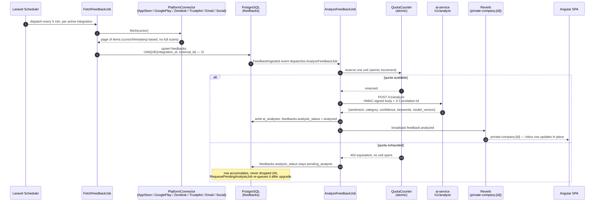
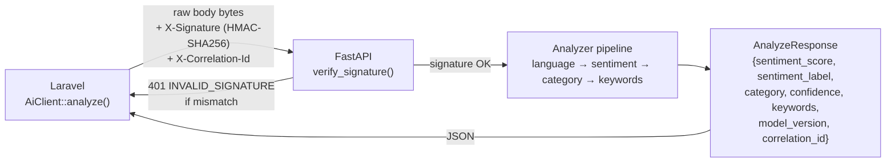
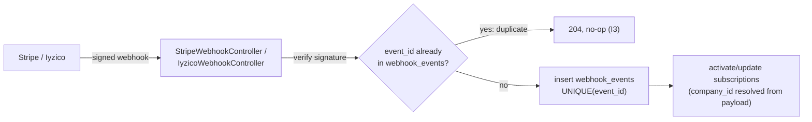
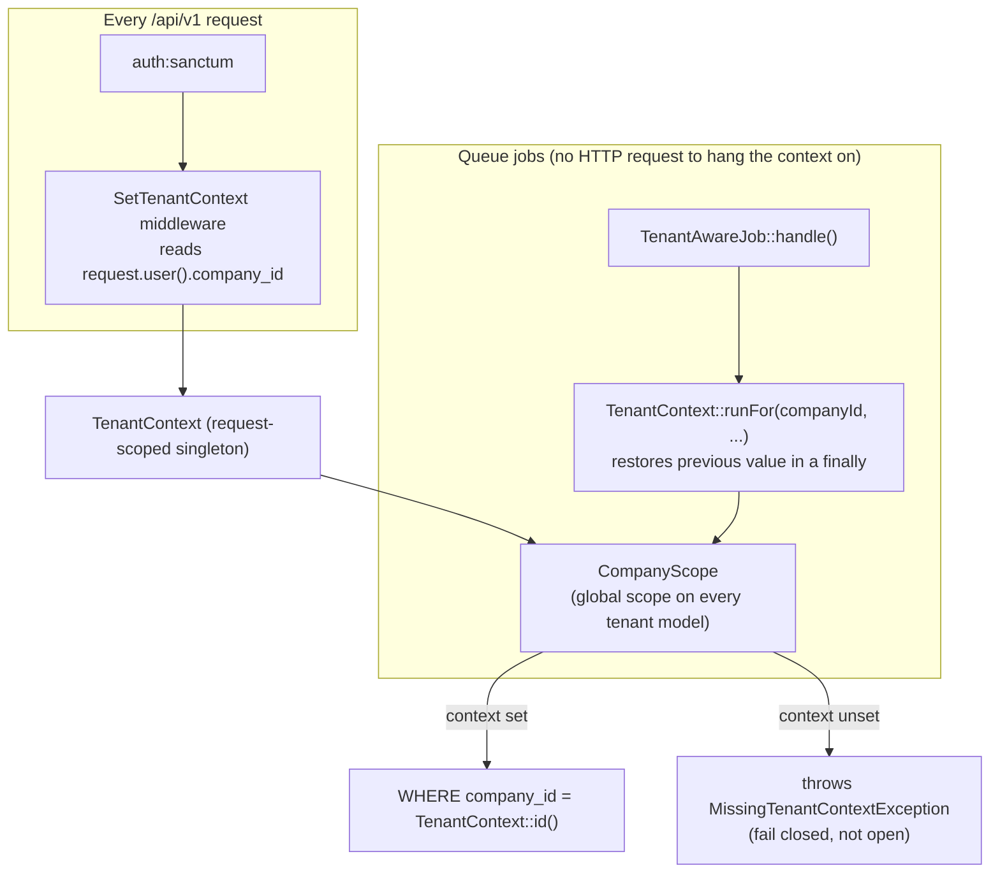

# Architecture

What is actually running in this repository today, not an idealised target. Where
the spec asks for something not yet built, it is left out of the diagram below and
tracked instead in `docs/adr/0010-deliberate-scope-exclusions.md`.

Source of truth for the numbered claims here: `docs/contracts/backend-core.md`,
`docs/contracts/http-api-v1.md`, `docs/contracts/realtime.md`, and the three
services' own source trees.

---

## 1. The three services

| Service | Stack | Owns | Statefulness |
|---|---|---|---|
| `backend/` | Laravel 13, PHP 8.3, Sanctum, Horizon+Redis, Reverb, PostgreSQL 16 | All product data, tenancy, quota, payments, ingestion scheduling, realtime broadcast | Stateful — the only service with a database |
| `ai-service/` | Python 3.12, FastAPI, ONNX Runtime | Language detection, sentiment, category, keyword extraction | **Stateless** (ADR-0004) — text in, JSON out, nothing persisted |
| `frontend/` | Angular 22, standalone components + Signals, TailwindCSS, zoneless | The SPA: landing, auth, inbox, integrations, settings, billing, `/402` | Stateless — Signal Store holds client-side view state only |

The backend is the only service that talks to a database or knows what a
"company" is. The AI service never sees a tenant, a feedback id, or a
correlation id's history — it is called once per request and forgets
everything it returned.

## 2. Data flow: ingestion through analysis to broadcast

Two things worth stating plainly:

- **The AI call never happens inside an HTTP request/response cycle.** Both
  ingestion and analysis are queue jobs (Horizon workers over Redis); a slow or
  down analyzer degrades queue depth, never a page load.
- **Quota is reserved before the analyzer is called, not after.** An exhausted
  quota therefore costs zero inference calls — the point of spec §7.4. If the
  call then fails, the reservation is released, so retries don't multiply the
  cost of one failing analysis.

## 3. Request/response shape: Laravel <-> FastAPI

The signature covers the exact bytes on the wire — the body is encoded once,
signed, and never re-encoded by the HTTP client, because a different key order
would produce a different signature on an equivalent payload. `correlation_id` is
caller-supplied by Laravel (propagated from the inbound HTTP request via
`CorrelationId` middleware) and both sides log it as a JSON field — Laravel
through `config/logging.php`'s `json` channel, the AI service through
`app/logging_config.py` — so one id ties a request's Laravel line, queue job, and
FastAPI line together in a log search (spec §3.6). Contract shape is enforced by
`contracts/` fixtures both sides read (invariant I7).

## 4. Payments and webhooks

`webhook_events` is the one table with no `company_id` — a webhook arrives before
the tenant is known, and the tenant is resolved *from* the payload rather than the
other way round (`docs/contracts/backend-core.md` §1). Iyzico carries no native
event id, so one is derived; both providers are covered by
`backend/tests/Fixtures/webhooks/{stripe,iyzico}/`.

## 5. Where the tenant boundary sits

`CompanyScope` is applied via the `BelongsToCompany` trait to `Subscription`,
`Integration`, `Feedback`, `AiAnalysis`, and `AuditLog`. `User` and `Company` are
the two documented exemptions (login must resolve a user *before* a tenant
exists, and a company cannot scope itself) — each is covered by its own
policy and isolation test instead, per `docs/contracts/backend-core.md` §2.
Cross-tenant access to a real row answers **404**, never 403, so existence is
never leaked (invariant I1).

`webhook_events` sits outside this boundary entirely: it carries no
`company_id` and never uses `BelongsToCompany` — the one model where a
`tenant-scope-guard` finding is expected and silenced with a documented
`bypass-ok` comment.

## 6. Frontend shape (brief — see `frontend/README.md` for the gate)

The SPA is a single Angular application, every feature route lazy-loaded, state
held in Signal Stores rather than NgRx. `HttpInterceptor`s attach the bearer
token, redirect on `401`, and open the paywall modal on `402 QUOTA_EXCEEDED`.
Realtime (`feedback.analyzed`, `quota.threshold-reached` over Reverb, per
`docs/contracts/realtime.md`) is loaded through a dynamic `import()` after auth
resolves — it does not enter the initial bundle, because `pusher-js` +
`laravel-echo` alone (≈18 kB brotli) would exceed the transfer headroom the
initial-bundle budget leaves (ADR-0007, ADR-0008).

## 7. What is deliberately not in this diagram

TOTP 2FA, IP/device risk scoring, Sentry/Prometheus, `/analyze/batch` usage
from the backend, a `model_version` reprocess command, staging/production
deploy, K8s manifests, and a Redis KPI cache are spec items not built. All six
spec §2 channels now have a connector — that gap is closed. Each remaining
exclusion is recorded with its reason in
`docs/adr/0010-deliberate-scope-exclusions.md` rather than drawn here as if it
existed.
